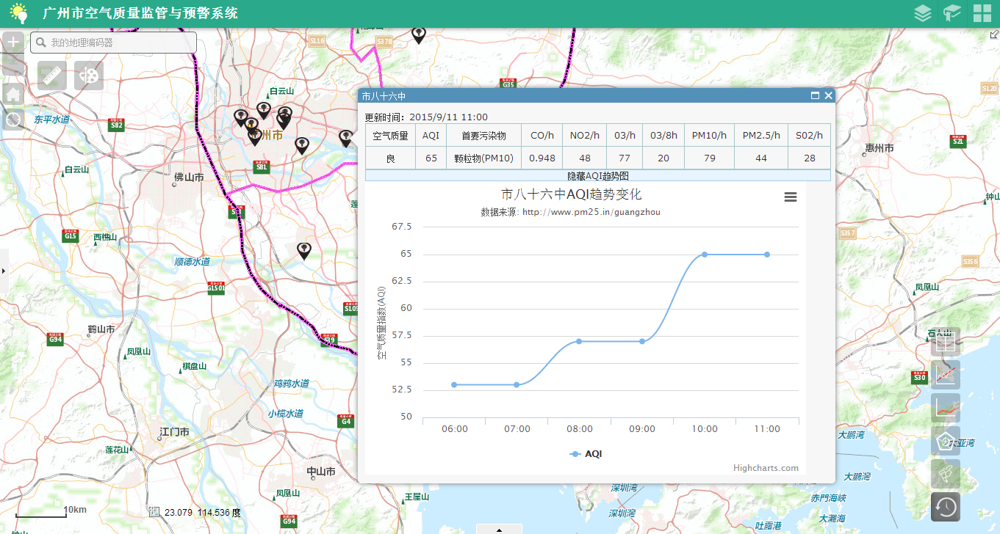
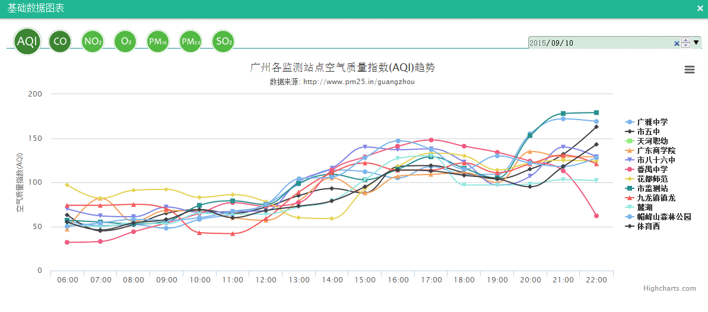
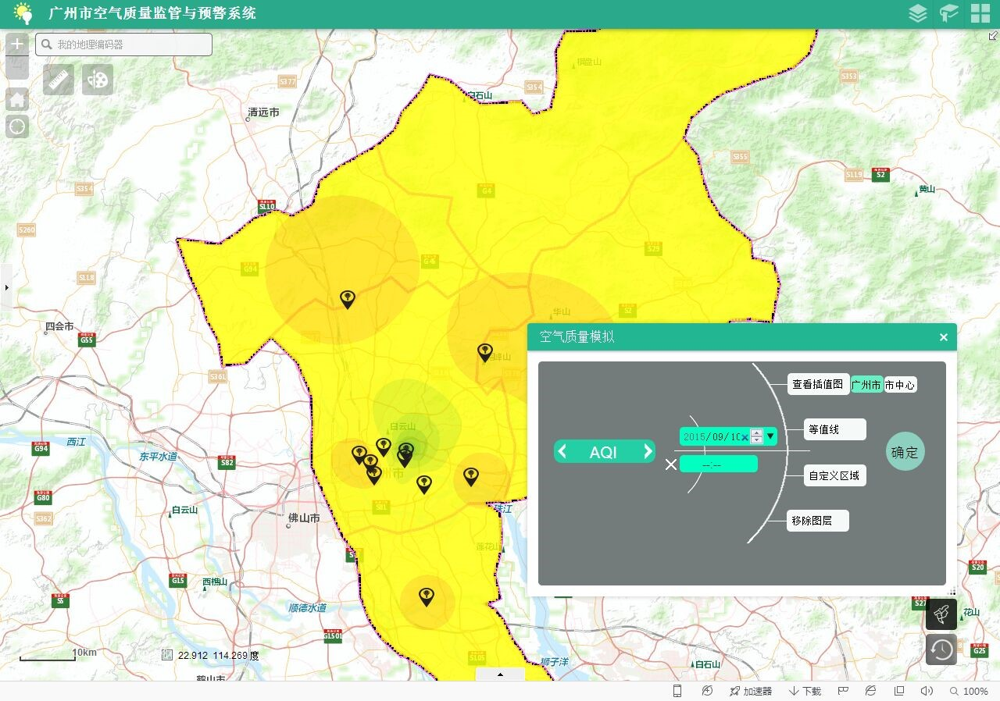
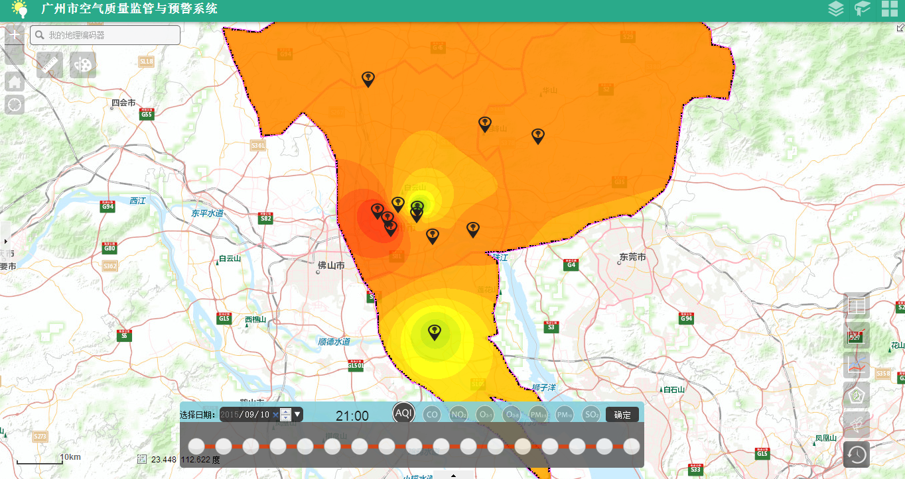

# 广州市空气质量监测与管理系统

> 忘记从什么时候开始，用颜色表示空气
>
> 不知道什么时候可以，用甜度描述空气
>
> ​                                                                  **——PM25.in**

## 作品概述

现阶段我国的经济发展正处于转型和升级的阶段，在发展过程中曾经被掩盖或不曾被关注的问题一一暴露出来，特别是环境问题如空气污染问题；而空气是我们人类每时每刻都必需的，当我们不知道我们每天呼吸的空气是怎样的，包含着哪些成分，实际上是对我们生命的不负责。

柴静的《穹顶之下》引发了中国公众的深思和反省，呼吁公众关注中国的环境问题特别是空气污染问题，而不再只是一味注重经济增速、城市化和工业化；身为GIS专业的学生，我们有责任有义务利用专业知识揭露环境污染现状，为分析和决策提供支持。

传统的空气质量实时发布系统只是对各污染物进行实时的监测和简单的专题制图，并未发挥出GIS系统的对比分析和模拟预测的作用。仅广州市，在每日每时的监测中，各监测站点积累了大量空气质量数据，这些数据在一定时段内反映着广州各地的空气质量水平及其变化规律，与广州的经济发展、交通流量、人口流动等方面的存在着联系，但由于缺乏对这些数据的统计和空间分析，有关部门未能很好地利用包含在其中的地理信息和统计信息。

因此，在完成对各空气污染物的监测功能的同时，利用这些的数据进行分析和模拟，在实现对广州空气质量水平有量的认识的基础上，了解空气污染的分布状况，使政府、企业和居民的决策从基于应对空气污染的模糊经验转变为基于数据和分析的较准确认识；并利用空气质量监测的时序数据进行模拟和预警分析，为城市规划决策、企业行为和个人行为提供可靠的依据，为各有关部门的专题性分析提供统计和分析数据。

## 功能设计

### 该系统分为三大模块：分别为空气质量监测、预警分析、辅助功能

**空气质量监测模块**包括数据的动态展示、多时相展示、以及历史数据查询。动态数据展示指每天显示更新的数据；数据的多时相展示指组织历史数据动态显示空气质量的变化；历史数据的查询则以专题图或图表的形式呈现。其中数据来源于[PM25.in](http://www.pm25.in/guangzhou) ，利用该网站提供的API获取包括PM2.5细颗粒物、PM10可吸入颗粒物、CO一氧化碳、NO2二氧化氮、O3臭氧1小时平均（或O3臭氧8小时平均）、SO2二氧化硫以及AQI空气质量指数在内的相关数据。

**预警分析模块**包括空气质量风险制图、污染源及其影响分析以及分析图表的生成（PNG/JPEF/SVG/PDF）。空气质量风险制图是结合各地实际情况，利用插值分析的方法模拟除监测站点外地区的空气质量，包括以反距离权重法模拟全市空气质量水平、以克里金法模拟市区空气质量水平、生成空气质量水平等值线以及预警制图。

**辅助功能模块**包括辅助知识、历史信息、相关链接，并提供相关文档下载，帮助居民了解空气质量水平的相关常识以及信息来源。

## 作品成果

### 查询与统计分析

### 空间分析

### 作品亮点

1. 数据抓取

   实时动态抓取网页上的空气质量数据并存入数据库中，同时还提供实时统计功能，为这个系统提供实时的数据支持。这个程序部署好之后，从早上6:00到晚上24:00，会一直监测数据源网站的数据是否有更新；现已有2015-04-08 至今每天各时段的空气质量数据。

2. 页面启动预警

   监测最新数据的AQI，以精确插值突显市区内空气污染较严重的区域，给人以警醒的效果。

3. 污染物数据实时监测和历史查询

   - 对各污染物，统计最新时间或历史时间内的平均值以及该日各时刻的污染物指数趋势（统计表和折线图）；
   - 对各污染物，统计连续几天至几十天的污染物指数趋势（折线图）；
   - 对各污染物数据，进行时序上的多元线性回归模拟，预测未来几天的污染物指数（折线图）。

4. 空气质量模拟的多样性

   - 在全市尺度内，以反距离权重法进行插值，反映广州市内空气质量的概况；
   - 在全市尺度内，以插值结果生成等值线，数字表示各区域的污染物指数；
   - 在全市尺度内，感兴趣区（绘制多边形）模拟广州市内某区域的空气质量水平，增强地图和模拟分析的交互性；
   - 由于监测站点主要位于市区内外，故就市区范围内以线性最优、无偏估计的普通克里金法插值，通过模型选择、参数估计和交叉检验后选择球状模型，以较高的准确性模拟市区的空气质量水平。

5. 按时间序列模拟空气质量

   由于监测站点主要位于市区内外，故就市区范围内，选择某天，对当日所有时段内某污染物，以线性最优、无偏估计的普通克里金法插值，通过模型选择、参数估计和交叉检验后选择球状模型（参数为majorRange: 41.59, partialSill: 133.53, lagSize: 0.004543），并以时间轴序列展示，可查看任何时段内的空气质量模拟。

6. 各污染物AQI贡献值及首要污染物计算

   选择某天，以极地蛛网图的形式展现各监测站点中各污染物（PM2.5,PM10,CO,NO2,O3,SO2）的AQI贡献值，并就各站点的空气质量指数和首要污染物对市民提出建议。

7. 系统界面交互性美观

   系统界面脱离了传统的生硬式响应，精心设计每一处响应方式，大量采用Css3所提供的变换、过渡以及动画属性。
